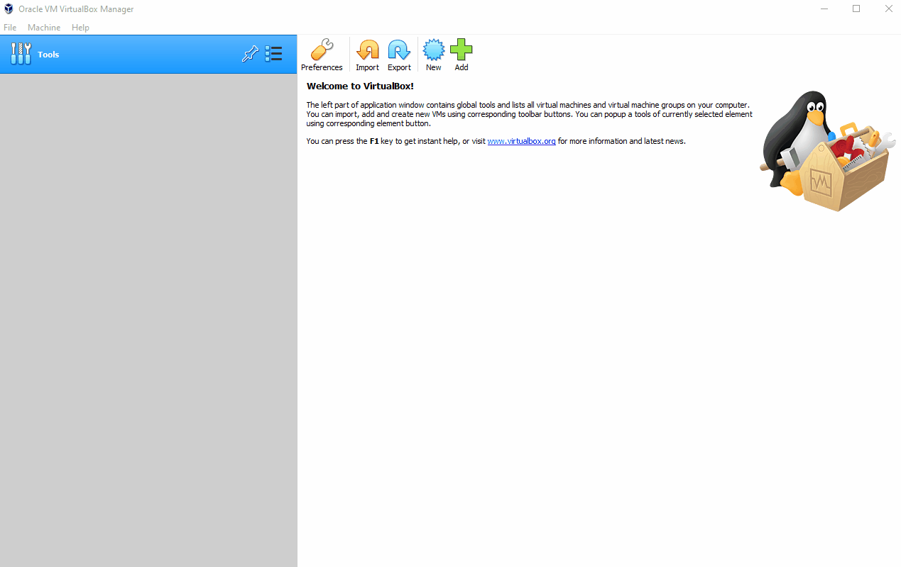
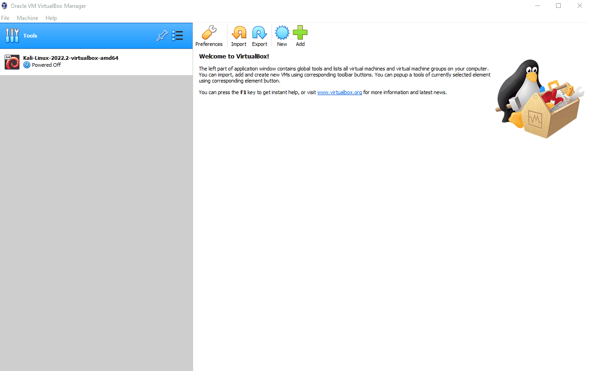

# Follina (CVE-2022-30190)

**Code execution through Microsoft Word and Microsoft Support Diagnostic Tool (MSDT).**

**Objective:** Create a virtual lab to simulate the Follina vulnerability.

**---------- This project has been put on hold as I study for my CompTIA Security+ exam ----------**

## Follina Deployment

To deploy the lab, I used two VirtualBox instances - one with Kali Linux and one with Windows 11.

**Kali Linux:** https://www.kali.org/get-kali/#kali-virtual-machines

<figcaption><b>Importing Kali Linux on VirtualBox</b></figcaption>

To download the Windows 11 ISO file, I created a Microsoft account and signed up for the Windows Insider Program.

**Windows Insider Program:** https://insider.windows.com/en-us/

The ISO download is available after signing up for the Windows Insider Program.

**Windows ISO Download:** https://www.microsoft.com/en-us/software-download/windowsinsiderpreviewiso?wa=wsignin1.0

<figcaption><b>Importing Windows 11 on VirtualBox</b></figcaption>

On the Windows 11 virtual machine, I installed the Office Deployment Tool.

**Microsoft Office Deployment Tool:** https://www.microsoft.com/en-us/download/details.aspx?id=49117

I also used the command `setup.exe /configure configuration-Orrice2021Enterprise.xml` to install Microsoft Office.

## Notes

Written up with information guided by Chuck Keith's and John Hammond's online educational content.
